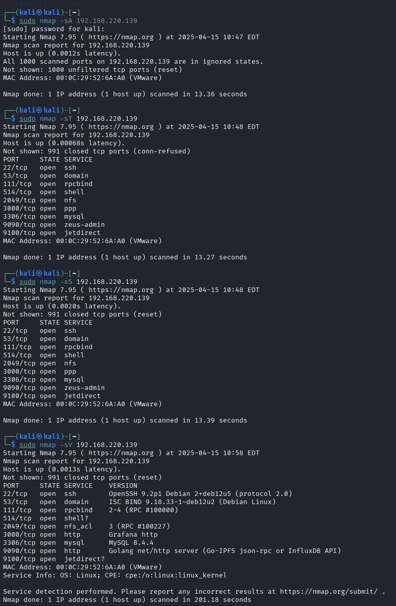
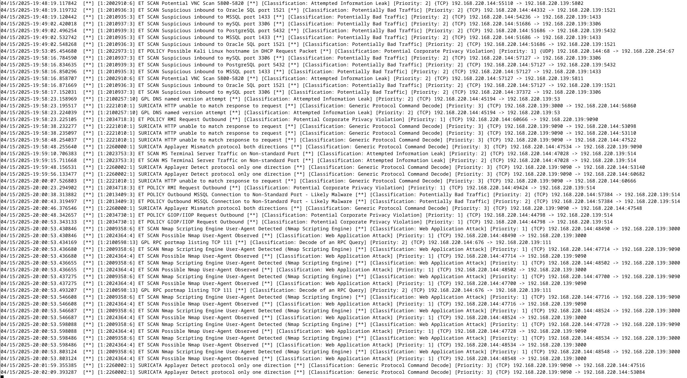
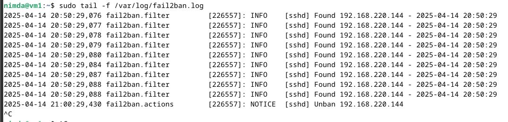
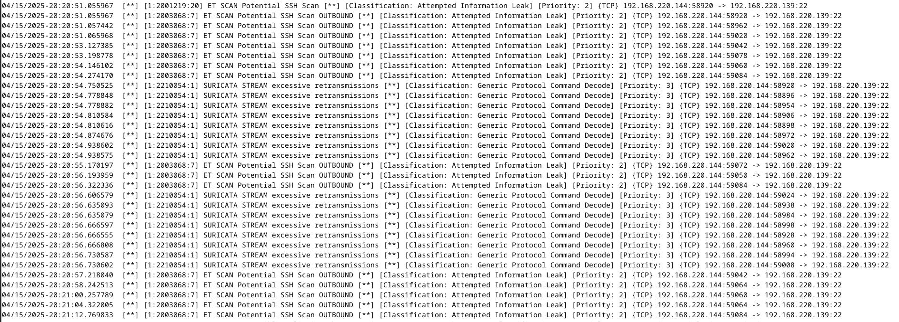
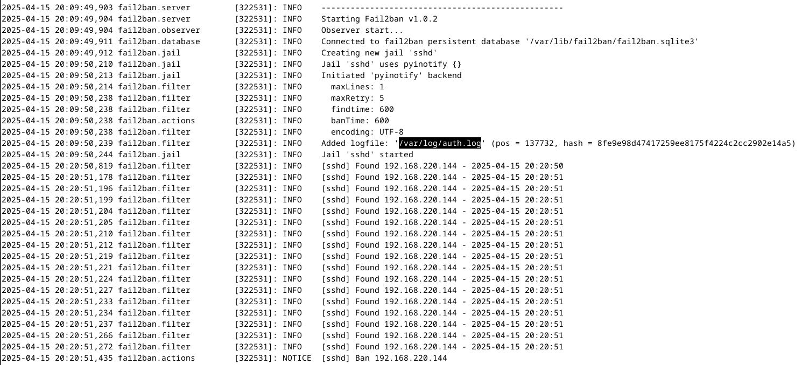

# Домашнее задание к занятию "`Защита сети`" - `Горелов Николай`


### Задание 1

Проведите разведку системы и определите, какие сетевые службы запущены на защищаемой системе:

**sudo nmap -sA < ip-адрес >**

**sudo nmap -sT < ip-адрес >**

**sudo nmap -sS < ip-адрес >**

**sudo nmap -sV < ip-адрес >**

По желанию можете поэкспериментировать с опциями: https://nmap.org/man/ru/man-briefoptions.html.


*В качестве ответа пришлите события, которые попали в логи Suricata и Fail2Ban, прокомментируйте результат.*

---

### Решение 1

### Выполненные сканирования:

1. **ACK-сканирование (-sA)**
   ```bash
   sudo nmap -sA 192.168.220.139 #Определение правил фильтрации пакетов
   ```
2. **TCP-сканирование (-sT)**
   ```bash
   sudo nmap -sT 192.168.220.139 #Полное установление TCP-соединений
   ```
3. **SYN-сканирование (-sS)**
   ```bash
   sudo nmap -sS 192.168.220.139 #"Тихое" сканирование без полного соединения
   ```
4. **Определение версий (-sV)**
   ```bash
   sudo nmap -sV 192.168.220.139 #Анализ работающих служб
   ```


### Логи Suricata:



Все типы сканирований были успешно обнаружены по характерным сигнатурам.

### Логи Fail2Ban



Тут почему-то fail2ban промолчал и показывал информацию предыдущего дня. Никаких действий при различных типах сканирования не показывал.

---

### Задание 2

Проведите атаку на подбор пароля для службы SSH:

**hydra -L users.txt -P pass.txt < ip-адрес > ssh**

1. Настройка **hydra**: 
 
 - создайте два файла: **users.txt** и **pass.txt**;
 - в каждой строчке первого файла должны быть имена пользователей, второго — пароли. В нашем случае это могут быть случайные строки, но ради эксперимента можете добавить имя и пароль существующего пользователя.

Дополнительная информация по **hydra**: https://kali.tools/?p=1847.

2. Включение защиты SSH для Fail2Ban:

-  открыть файл /etc/fail2ban/jail.conf,
-  найти секцию **ssh**,
-  установить **enabled**  в **true**.

Дополнительная информация по **Fail2Ban**:https://putty.org.ru/articles/fail2ban-ssh.html.


*В качестве ответа пришлите события, которые попали в логи Suricata и Fail2Ban, прокомментируйте результат.*

---

### Решение 2



Suricata детектировала попытки сканирования SSH порта хоста и сообщала об этом.



Fail2ban также отреагировал на множественное сканирование и после некоторого числа неудачных попыток заблокировал ip нападающей системы.

---